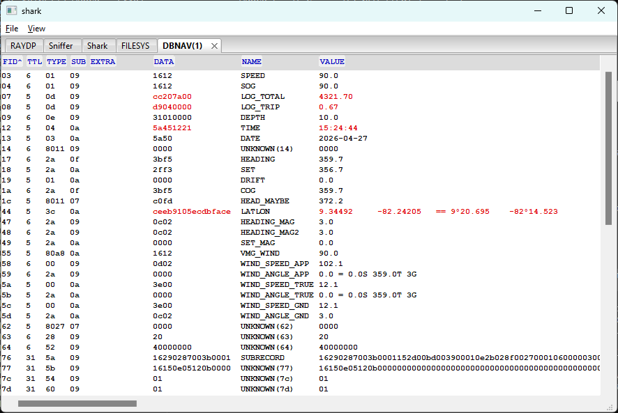

# winDBNAV - Live Navigation Data

**[shark](shark.md)** --
**[winRAYDP](winRAYDP.md)** --
**[winSniffer](winSniffer.md)** --
**[winShark](winShark.md)** --
**[winFILESYS](winFILESYS.md)** --
**winDBNAV**

Folders: **[Raymarine](../../../docs/readme.md)** --
**[NET](../../../NET/docs/readme.md)** --
**[FSH](../../../FSH/docs/readme.md)** --
**[CSV](../../../CSV/docs/readme.md)** --
**shark** --
**[navMate](../../../apps/navMate/docs/readme.md)**

**winDBNAV** is a live read-only view of navigation field values broadcast by the
E80 over the [DBNAV](../../../NET/docs/DBNAV.md) multicast service (port 2562). The tab title is **DBNAV(n)**
where n is the instance number; multiple instances can be opened simultaneously.
There are no user controls beyond column sorting.

Above you can see, for example, that the LATLON fields are shown in red, indicating
they have recently changed - which is useful for probing the protocol by changing
E80 state and observing which fields respond.

## Columns

| Column | Description |
| ------ | ----------- |
| FID    | Field ID in hex. The active sort column shows a direction indicator (`^` ascending, `v` descending) |
| TTL    | Time-to-live counter from the broadcast packet |
| TYPE   | Field type byte in hex |
| SUB    | Subtype byte in hex |
| EXTRA  | Extra field data |
| DATA   | Raw field data as a hex string, truncated to 16 characters |
| NAME   | Field name from the DBNAV field dictionary, or `UNKNOWN(fid)` for unrecognized field IDs |
| VALUE  | Decoded value, with special formatting for certain field types (see below) |

## Value formatting

Three field name patterns receive special formatting in the VALUE column:

| Pattern | Format |
| ------- | ------ |
| `*latLon*` | Decimal degrees plus degrees-minutes: `9.34492 -82.24205 == 9deg20.695 -82deg14.523` |
| `*northEast*` | Raw E80 integer values plus converted lat/lon in degrees-minutes |
| `*WindAngle*` | Degrees plus port/starboard notation: `0.0 == 0.0S 359.0T 3G` |

## Sorting

All columns are sortable by clicking the column header; clicking again reverses
direction. FID, TTL, TYPE, SUB sort numerically; NAME, EXTRA, VALUE, and DATA
sort alphabetically on their display strings.

The display updates continuously as new DBNAV broadcast packets arrive from the E80.

---

**Next:** [Cables](../../../NET/docs/ethernet_cables.md)
