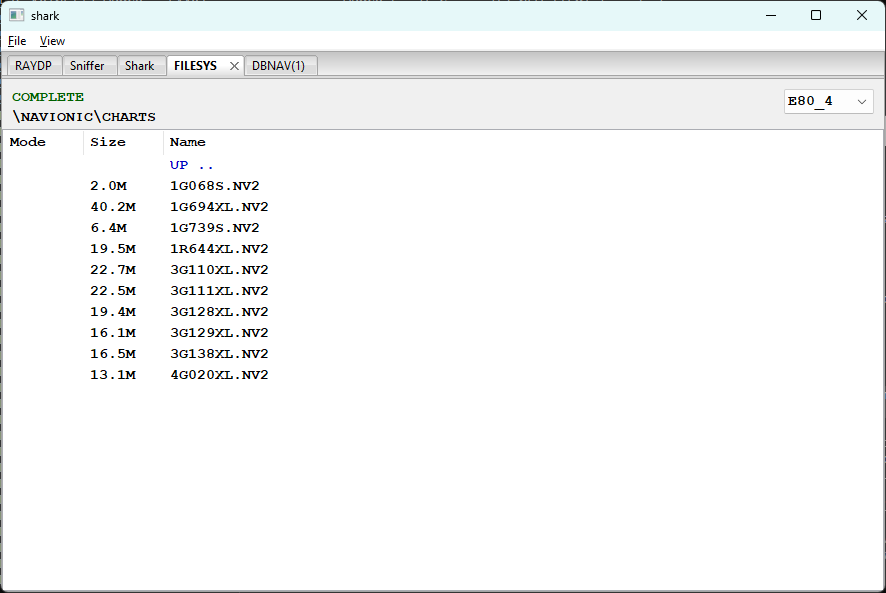

# winFILESYS - CF Card File Browser

**[shark](shark.md)** --
**[winRAYDP](winRAYDP.md)** --
**[winSniffer](winSniffer.md)** --
**[winShark](winShark.md)** --
**winFILESYS** --
**[winDBNAV](winDBNAV.md)**

Folders: **[Raymarine](../../../docs/readme.md)** --
**[NET](../../../NET/docs/readme.md)** --
**[FSH](../../../FSH/docs/readme.md)** --
**[CSV](../../../CSV/docs/readme.md)** --
**shark** --
**[navMate](../../../apps/navMate/docs/readme.md)**

**winFILESYS** is a read-only file browser for the CompactFlash card in the E80,
accessed via the [FILESYS](../../../NET/docs/FILESYS.md) protocol (port 2049). It supports directory navigation
and file download, including recursive directory download.

## Header area

| Element | Description |
| ------- | ----------- |
| Status (top left) | Current FILESYS protocol state: **COMPLETE** (green), **ERROR** (red), **START** (blue), **ILLEGAL** (grey) |
| Path (below status) | Current directory path on the CF card, prefixed by the volume label |
| Device combo (top right) | Selects which E80's FILESYS port to browse when multiple E80s are on the network. Populated automatically from [RAYDP](../../../NET/docs/RAYDP.md) discovery |

## File list

Three columns:

| Column | Description |
| ------ | ----------- |
| Mode   | FAT filesystem attribute flags: `r` = read-only, `h` = hidden, `s` = system. Blank for ordinary files |
| Size   | File size in human-readable form (e.g. `40.2M`). Fetched via individual SIZE requests after the directory listing arrives; may be blank briefly |
| Name   | File or directory name. Directories appear in blue. **ROOT** (volume root) and **UP ..** (parent directory) are always pinned at the top of the list |

Clicking a column header sorts by that column; clicking the same header again
reverses direction. Directories always sort above files regardless of the active
sort column.

## Navigation and download

- **Double-click a directory** - navigate into it
- **Double-click UP ..** - navigate to the parent directory
- **Double-click a file** - opens a Save As dialog and downloads the file;
  a progress dialog appears for files larger than 1 MB
- **Right-click** - context menu with a **Download** option for downloading
  multiple selected items. Selecting a mix of files and directories triggers
  a folder selection dialog followed by a recursive download with a progress
  dialog tracking directories traversed and files downloaded

---

**Next:** [winDBNAV](winDBNAV.md)
