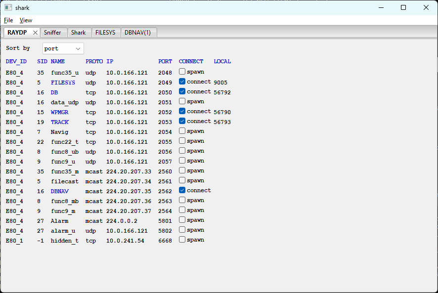

# winRAYDP — Live Service Discovery

**[Home](../../../docs/readme.md)** --
**[NET](../../../NET/docs/readme.md)** --
**[shark](shark.md)** --
**winRAYDP** --
**[winSniffer](winSniffer.md)** --
**[winShark](winShark.md)** --
**[winFILESYS](winFILESYS.md)** --
**[winDBNAV](winDBNAV.md)** --
**[Cables](../../../NET/docs/ethernet_cables.md)**

**winRAYDP** is a live view of every [RAYNET](../../../NET/docs/RAYNET.md) service currently being advertised on
the network by the [RAYDP](../../../NET/docs/RAYDP.md) discovery protocol. Rows appear and disappear dynamically
as devices announce or withdraw services.

## Columns

| Column  | Description |
| ------- | ----------- |
| DEV_ID  | Friendly device name (e.g. `E80_4`, `E80_1`) resolved from the hardware device ID in the RAYDP advertisement |
| SID     | Service ID — the numeric RAYNET service_id field |
| NAME    | RAYNAME. Implemented services shown in **blue**; all others in black |
| PROTO   | Protocol — `tcp`, `udp`, or `mcast` |
| IP      | Device IP address, or multicast group address for mcast services |
| PORT    | Service port number |
| CONNECT | Action checkbox. For implemented services ([FILESYS](../../../NET/docs/FILESYS.md), DB, [WPMGR](../../../NET/docs/WPMGR.md), [TRACK](../../../NET/docs/TRACK.md), [DBNAV](../../../NET/docs/DBNAV.md)), labeled **connect** — checking connects shark to that service, unchecking disconnects. For all other services, labeled **spawn** — checking opens a raw connection for manual probing |
| LOCAL   | Local port assigned on the laptop side, shown only when it differs from the service port. Blank for multicast services and when the OS assigns the same port number |

## Sort by

The **Sort by** combo box at the top selects the display order:
**port** (default), **service** (by SID), **device** (by DEV_ID), or
**num** (raw arrival order as services were first announced).

## Behavior

Rows are added as RAYDP advertisement packets arrive and removed when a device
goes away. Connected services maintain their connection state across sort changes.
The LOCAL column shows the OS-assigned ephemeral port for TCP services and is
suppressed when it would duplicate the service port number.

---

**Next:** [winSniffer](winSniffer.md)
