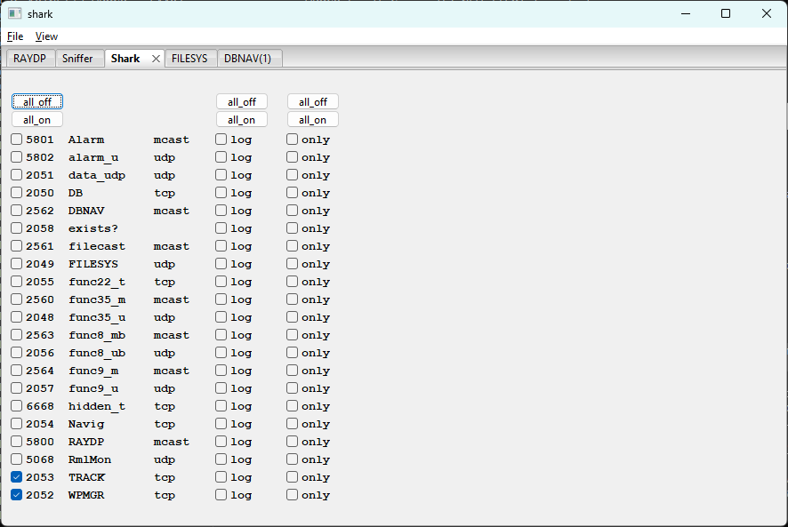

# winShark - Protocol Monitoring Control

**[shark](shark.md)** --
**[winRAYDP](winRAYDP.md)** --
**[winSniffer](winSniffer.md)** --
**winShark** --
**[winFILESYS](winFILESYS.md)** --
**[winDBNAV](winDBNAV.md)**

repos: **[phorton1](https://github.com/phorton1)** --
**[Ray Library](https://github.com/phorton1/base-Pub-Ray/blob/master/docs/readme.md)** --
**shark Tool** --
**[navMate App](https://github.com/phorton1/base-apps-navMate/blob/master/docs/readme.md)**

**winShark** is the control panel for shark's active protocol monitoring - the
traffic that shark's own [RAYNET](https://github.com/phorton1/base-Pub-Ray/blob/master/NET/docs/RAYNET.md) service connections send and receive. It has no
master on/off; individual ports are gated by their active checkbox.

## Per-port rows

One row per RAYNET port, sorted alphabetically by RAYNAME. Each row shows port
number, RAYNAME, and protocol type, followed by three checkboxes:

| Checkbox | Description |
| -------- | ----------- |
| active   | Whether shark processes and displays traffic on this port. When unchecked, the service may still be connected (see [winRAYDP](winRAYDP.md)) but produces no output |
| log      | Write traffic to `shark.log` or `rns.log` (selected by packet origin) in addition to showing it on the console |
| only     | Suppress console output and write to the log file only. Useful for high-volume ports during a session where console noise would be overwhelming |

At startup, **[TRACK](https://github.com/phorton1/base-Pub-Ray/blob/master/NET/docs/TRACK.md)** and **[WPMGR](https://github.com/phorton1/base-Pub-Ray/blob/master/NET/docs/WPMGR.md)** have their active checkboxes checked by
default, reflecting the `$ACTIVE_TRACK` and `$ACTIVE_WPMGR` defaults in
`NET/a_mon.pm`. All other ports start inactive.

## Bulk buttons

Three pairs of **all_off / all_on** buttons at the top of the active, log, and
only columns set all rows in that column simultaneously.

## Relationship to winSniffer

winShark and winSniffer are separate control planes. winShark governs what shark
shows from its own protocol connections; winSniffer governs what tshark captures
from the wire. A port can be active in one, both, or neither. The **self**
checkbox in winSniffer cross-links the two: when checked for a port, shark's own
packets appear in the sniffer output as well.

---

**Next:** [winFILESYS](winFILESYS.md)
