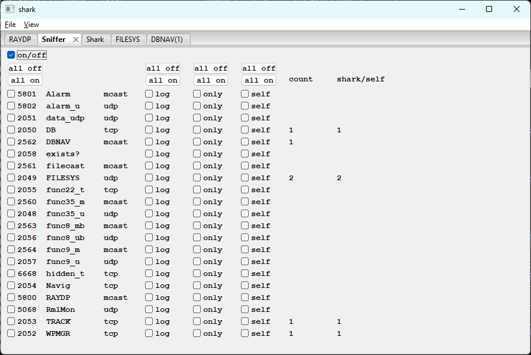

# winSniffer - Packet Sniffer Control

**[shark](shark.md)** --
**[winRAYDP](winRAYDP.md)** --
**winSniffer** --
**[winShark](winShark.md)** --
**[winFILESYS](winFILESYS.md)** --
**[winDBNAV](winDBNAV.md)**

repos: **[phorton1](https://github.com/phorton1)** --
**[Ray Library](https://github.com/phorton1/base-Pub-Ray/blob/master/docs/readme.md)** --
**shark Tool** --
**[navMate App](https://github.com/phorton1/base-apps-navMate/blob/master/docs/readme.md)**

**winSniffer** is the control panel for shark's tshark-based packet sniffer. The
sniffer monitors raw ethernet traffic between the E80 and other devices (such as
RNS) independently of shark's own protocol connections.

## Master on/off

The **on/off** checkbox at the top starts and stops the tshark sniffer process.
When unchecked, the per-port checkboxes are inert and the count columns do not
update.

## Per-service rows

One row per [RAYNET](https://github.com/phorton1/base-Pub-Ray/blob/master/NET/docs/RAYNET.md) service, in two groups: the **fixed** (always-on)
services first, in port-number order, then the **instrument tail** in service-id
order. The fixed services are keyed by their deterministic port number; the
**instrument tail** (GPS, AutoPilot, Radar, the sonars, DGPS, Compass, Navtex,
AIS) is keyed by `sid:proto` (e.g. `8:mcast`) rather than a port, because each
takes the next free runtime port as its data appears. The sniffer resolves a
captured tail packet to its row by reading the service id from the packet and the
mcast-vs-udp face from the destination address. Each row shows that key, the
RAYNAME, and the protocol type, followed by four checkboxes:

| Checkbox | Description |
| -------- | ----------- |
| active   | Whether to process and display captured packets for this port on the shark console |
| log      | Write captured packets to the sniffer log file |
| only     | Suppress console output and write to the log file only |
| self     | Include packets originating from shark itself in the sniffer capture, so shark's own traffic to/from the E80 appears alongside externally-sniffed traffic |

## Bulk buttons

Four pairs of **all_off / all_on** buttons at the top of the active, log, only,
and self columns set all rows in that column simultaneously.

## Count columns

Two read-only columns at the right update live while the sniffer is running:

| Column     | Description |
| ---------- | ----------- |
| count      | Total packets captured by tshark for this port |
| shark/self | Packets on this port that originated from shark itself |

These counters increment regardless of the active checkbox state - tshark captures
all matching traffic whether or not shark is processing it for display.

## Relationship to winShark

winSniffer and winShark are separate control planes. winSniffer governs what
tshark captures from the wire; winShark governs what shark shows from its own
protocol connections. A port can be active in one, both, or neither. The **self**
checkbox cross-links the two: when checked for a port, shark's own packets on
that port appear in the sniffer output as well.

---

**Next:** [winShark](winShark.md)
